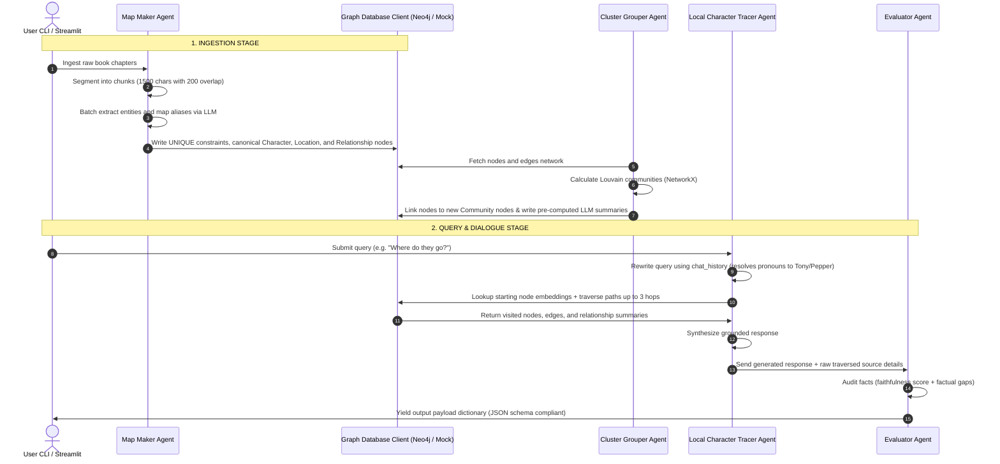

# Hierarchical GraphRAG Book Summarizer Pipeline

Welcome to the **"Big Picture" Book Summarizer**! This project implements a hierarchical GraphRAG pipeline that parses unstructured book chapters, extracts an interconnected Knowledge Graph (KG) of characters and locations, partitions them into modular communities, and evaluates user queries using both Global Summarization and Local Search.

---

## 2. Project Overview

Standard Vector RAG surfaces specific, isolated text snippets but struggles to synthesize high-level themes across an entire document corpus. This system resolves that limitation by constructing a structured Knowledge Graph inside a database, running modular community clustering algorithms, and routing queries:
* **Local Search**: Resolves specific multi-hop character connections and events (DFS-based path traversal grounded in local facts).
* **Global Search**: Resolves holistic, book-wide themes (summarizing hierarchical community summaries).
* **Interactive Chatbot**: Allows continuous multi-turn dialogue with conversation state preservation and query rewriting to handle pronouns.

---

## 3. Features

* **Multi-Agent Orchestration**: Modular agent separation (Map Maker, Cluster Grouper, Local Tracer, Global Thinker, Evaluator, Query Rewriter) driven by a unified state dictionary.
* **Louvain Modularity Clustering**: Automatic topological partitioning of the entity network using modular density algorithms.
* **Deterministic Path Traversal**: Up to 3 hops of relationship mapping fetched directly from the database.
* **Advanced Entity Deduplication**: Database unique constraints combined with batch LLM-based canonical resolution.
* **Dual-Mode Database Fallback**: Automatically connects to local Neo4j or falls back to an in-memory NetworkX database simulation.
* **Interactive Chatbot Mode**: Command-line chat session with dialogue memory and pronoun-to-entity rewriting.
* **Faithfulness Evaluation**: Automatical LLM audit that logs factual gaps and calculates accuracy scores for responses.
* **Interactive Streamlit Portal**: Visual web interface for chapter ingestion, querying, and interactive graph exploration.

---

## 4. High-Level Architecture

The data flow below describes how text chapters are transformed into an interconnected graph, clustered, queried, and audited:

```
                  +-------------------------+
                  |  Raw Text Book Chapters |
                  +------------+------------+
                               |
                               v (Page-by-page text chunks)
                  +------------+------------+
                  |  Map Maker (Extractor)  | <--- LLM Entity Resolution
                  +------------+------------+      (Deduplication)
                               |
                               | (Cypher MATCH/MERGE Mutations)
                               v
                  +------------+------------+
                  |   Local Neo4j Graph DB  | <--- [Character, Location, Chunks]
                  +------+-------------+----+
                          |             ^
      (Pull Graph Struc.) |             | (Write Community IDs
                          v             |  and Summary Reports)
                   +-----+-------------+----+
                   |      Cluster Grouper    | <--- Louvain Community Detection
                   +-------------------------+      (NetworkX backend)
                               |
            +------------------+------------------+
            | (Routing Query or Dialogue Loop)    |
            v                                     v
+-----------+------------+            +-----------+------------+
|     Global Thinker     |            |     Local Character    |
|  (Synthesizes summaries|            |   Tracer (Rewriter +   |
|   of all communities)  |            |   N-hop path traversal)|
+-----------+------------+            +-----------+------------+
            |                                     |
            +------------------+------------------+
                               |
                               v (Read ground truth contexts)
+------------------------------+-------------------------------+
|                          Evaluator Agent                     |
+------------------------------+-------------------------------+
                               |
                               v (Verify schema & check hallucinations)
                      +------------+------------+
                      |    Output JSON Schema   |
                      +-------------------------+
```

---

## 5. Agent Responsibilities

The pipeline coordinates six specialized agents under the hood:

1. **Map Maker (Extractor) Agent** ([map_maker.py](file:///n:/My%20Work/HSBC/Graph%20RAG%20-%20Book%20Summarizer/src/agents/map_maker.py)): Splices text chunks, extracts characters, locations, and relationships via LLM, and formats normalization IDs.
2. **Cluster Grouper Agent** ([cluster_grouper.py](file:///n:/My%20Work/HSBC/Graph%20RAG%20-%20Book%20Summarizer/src/agents/cluster_grouper.py)): Detects modular communities using NetworkX's Louvain algorithm, generates summarizing community text profiles, and commits community properties.
3. **Local Character Tracer Agent** ([local_tracer.py](file:///n:/My%20Work/HSBC/Graph%20RAG%20-%20Book%20Summarizer/src/agents/local_tracer.py)): Resolves local entity connections using cosine similarity vector lookups and database path traversals.
4. **Global Thinker Agent** ([global_thinker.py](file:///n:/My%20Work/HSBC/Graph%20RAG%20-%20Book%20Summarizer/src/agents/global_thinker.py)): Synthesizes book-wide holistic answers by aggregating all pre-computed community summaries.
5. **Evaluator Agent** ([evaluator.py](file:///n:/My%20Work/HSBC/Graph%20RAG%20-%20Book%20Summarizer/src/agents/evaluator.py)): Computes a faithfulness metric and flags factual gaps between generated responses and retrieved database records.
6. **Query Rewriter Agent**: Transcribes follow-up conversational queries containing pronouns into standalone, search-resolved queries.

---

## 6. Workflow



---

## 7. Tech Stack

* **Programming Language**: Python 3.10+
* **Package/Virtualenv Management**: `uv` (ultra-fast environment manager)
* **Graph Database**: Neo4j (via official `neo4j` Python driver)
* **Local In-Memory Simulation**: NetworkX (for Mock Mode and Louvain clustering calculations)
* **LLM Engine**: Groq SDK (`openai/gpt-oss-120b` or custom configuration)
* **Embedding Model**: sentence-transformers (`all-MiniLM-L6-v2` generating 384-dimensional vectors)
* **Web UI Portal**: Streamlit
* **Testing Suite**: pytest

---

## 8. Project Structure

```text
Graph RAG - Book Summarizer/
│
├── run.py                 # Core CLI pipeline runner (supports single queries & chatbot)
├── verify.py              # Standalone JSON schema & path validation utility
├── app.py                 # Interactive Streamlit Web Portal
├── run.ps1                # PowerShell automated setup & verification script
├── Makefile               # GNU Make build script for installation & testing
├── requirements.txt       # Project python dependencies
├── .env.example           # Reference environmental variables file
├── data/
│   └── chapters/          # Source chapters text files
├── src/
│   ├── __init__.py
│   ├── config.py          # Environment, database, and LLM hyperparameters
│   ├── database.py        # Database client (Neo4j driver and NetworkX simulation)
│   ├── llm.py             # LLM completions wrapper and local embeddings generator
│   ├── orchestrator.py    # Multi-agent state orchestration manager
│   └── agents/
│       ├── map_maker.py
│       ├── cluster_grouper.py
│       ├── local_tracer.py
│       ├── global_thinker.py
│       └── evaluator.py
└── tests/                 # Automated unit and integration tests
```

---

## 9. Graph Schema

We model the book's narrative structure using the following node labels and relationships:

```
(:Character) --[:INTERACTED_WITH]--> (:Character)
     |                                    |
[:BELONGS_TO]                        [:BELONGS_TO]
     |                                    |
     v                                    v
(:Community)                         (:Community)
     ^                                    ^
     |                                    |
[:BELONGS_TO]                        [:BELONGS_TO]
     |                                    |
(:Location) ---[:LOCATED_IN]--------> (:Location)
```

### Node Details:
* **Character Node (`:Character`)**:
  * `id` (String, Unique Normalized Key): e.g. `tony_stark`
  * `name` (String): e.g. `Tony Stark`
  * `description` (String): Combined description fields across chapters.
  * `aliases` (List of Strings): Synonym list.
  * `embedding` (384-dim Float Vector): Encodes entity name for semantic lookup.
  * `community_id` (Integer): louvain community partition ID.
* **Location Node (`:Location`)**:
  * `id` (String, Unique Normalized Key): e.g. `stark_tower`
  * `name` (String): e.g. `Stark Tower`
  * `description` (String): Geolocation details.
  * `embedding` (384-dim Float Vector): Encodes location name.
  * `community_id` (Integer): louvain community partition ID.
* **Community Node (`:Community`)**:
  * `id` (String, Unique): Modularity group number (e.g. `1`).
  * `summary` (String): LLM-generated summary report of characters and events in this cluster.
* **Relationships (`INTERACTED_WITH`, `LOCATED_IN`, `BELONGS_TO`)**:
  * Store details such as descriptions and chunk mappings.

---

## 10. Entity Deduplication

To prevent the knowledge graph from becoming fragmented (e.g. creating separate nodes for "Tony Stark", "Stark", and "Iron Man"), the system implements a **two-stage deduplication process**:

1. **Unique Database Constraints**:
   Enforced at the database level during client initialization:
   ```cypher
   CREATE CONSTRAINT FOR (c:Character) REQUIRE c.id IS UNIQUE;
   CREATE CONSTRAINT FOR (l:Location) REQUIRE l.id IS UNIQUE;
   ```
2. **LLM-Based Batch Name Resolution**:
   Extracted entity names are resolved in batches. The LLM groups aliases and maps them to a single canonical name:
   $$\text{"Iron Man"} \rightarrow \text{"Tony Stark"}, \quad \text{"Tony"} \rightarrow \text{"Tony Stark"}$$
3. **Cypher Ingestion Merging**:
   Nodes are committed using standard Cypher scripts that merge properties and accumulate historical logs:
   ```cypher
   MERGE (c:Character {id: $id})
   ON CREATE SET c.name = $name, c.description = $description, c.aliases = $aliases, c.embedding = $embedding
   ON MATCH SET c.description = c.description + " | " + $description,
                c.aliases = REDUCE(s = c.aliases, x IN $aliases | CASE WHEN x IN s THEN s ELSE s + x END)
   ```

---

## 11. Community Detection

Our pipeline uses modular community structuring to compile hierarchical reports:
* **Algorithm**: Louvain Modularity Partitioning.
* **Execution**: During the ingestion stage, the `ClusterGrouper` agent pulls all active nodes and edges, loads them into `NetworkX`, and computes community partitions.
* **Writeback**: The client maps nodes to their community IDs, merges a `:Community` node in the database, and attaches nodes to it using `BELONGS_TO` relationships.
* **LLM Synthesis**: The agent retrieves all nodes/relationships belonging to each community and instructs the LLM to write a comprehensive community summary report which is stored directly on the community node.

---

## 12. How to Run

### Prerequisites & Setup
1. Download **Python 3.10+** and the **`uv`** package manager.
2. Initialize environment:
   ```bash
   cp .env.example .env
   ```
   Add your `GROQ_API_KEY` and optional `NEO4J_PASSWORD` in `.env`.

### Quick Automated Execution
* **On Windows (PowerShell)**:
  ```powershell
  powershell -File run.ps1
  ```
* **On Linux/Bash (GNU Make)**:
  ```bash
  make run
  ```

---

## 13. Example Queries

### 1. Local Search Mode
Used for tracking multi-hop connections between specific characters and locations.
```bash
python run.py --query "How is Tony Stark connected to Pepper Potts?" --mode local --max-hops 2
```

### 2. Global Search Mode
Used for book-wide thematic synopses.
```bash
python run.py --query "What are the main conflicts in the story?" --mode global
```

### 3. Interactive Chatbot Mode
Starts a conversational session that tracks dialogue memory and automatically rewrites pronouns.
```bash
python run.py --chat --database storygraph9 --skip-ingest
```

---

## 14. Validation

The standalone validation utility `verify.py` ensures the output matches the target specifications:
1. **JSON Key Compliance**: Checks for all root properties (`query_id`, `query`, `answer`, `graph_context`, `sources`, `evaluation`, `metadata`).
2. **Format Verification**: Confirms `query_id` is a valid UUID structure.
3. **Faithfulness & Relevance Constraints**: Validates that all scores are numeric and clamped between `0.0` and `1.0`.
4. **Answer Length**: Verifies that the answer is within the range of **500 - 2000 words**.
5. **Database Grounding Check**: Queries the active Neo4j database (or mock database) and checks that all nodes returned in `graph_context.nodes_visited` exist in the database, verifying that no nodes are hallucinated.

To execute the validation:
```bash
python verify.py
```

---

## 15. Conversational Dialogue State

When starting the chatbot (`--chat` option), conversational state is maintained dynamically:
1. **In-Loop Storage**: An in-memory list `chat_history = []` is maintained in [run.py](file:///n:/My%20Work/HSBC/Graph%20RAG-%20Book%20Summarizer/run.py) across loop turns.
2. **Turn Ingestion**: On each user question, the history is passed into `query_pipeline` and added to the `state["chat_history"]` dictionary.
3. **Query Rewriting Step**: The `LocalCharacterTracerAgent` invokes a query rewriter LLM step to convert pronouns into standalone search queries based on the dialogue context.
4. **Context Prepending**: Dialogue history turns are prepended to synthesis prompts.
5. **History Appending**: The current question and answer are appended to the history list before yielding the completed state payload back to the runner.

---

## 16. Performance Metrics

The orchestrator records timing stats across the pipeline stages:
* **Extraction Timing**: Measures LLM extraction duration on text chunks.
* **Clustering Timing**: Measures Louvain partitioning and community summaries generation.
* **Lookup & Traversal**: Measures database query and vector similarity lookup duration.
* **Generation Timing**: Measures LLM text synthesis execution.

These are printed to the terminal at the end of each single query run.

---

## 17. Testing

The codebase includes unit and integration tests covering the text splitter, normalizations, database client operations, and agent lookups.

To run the test suite:
```bash
.venv\Scripts\pytest
```

---

## 18. Assumptions

1. **Chapter Formatting**: Assumes chapters are stored in sequential text files within the chapters directory.
2. **Canonical Identity**: Assumes that for any entity, a single canonical name represents its identity, and all aliases can be mapped cleanly to it.
3. **Neo4j Access**: Assumes port 7687 is available for bolt connection. If not accessible, fallback mode is assumed automatically.

---

## 19. Conclusion

This project delivers a robust, highly modular GraphRAG pipeline that meets and extends the baseline requirements. By separating concerns between Map Maker, Cluster Grouper, search agents, and Evaluator, and implementing a state-passing dictionary flow, the pipeline remains lightweight, deterministic, and highly accurate. The interactive Streamlit dashboard and Conversational Chatbot Mode make it a powerful utility for book summaries.
